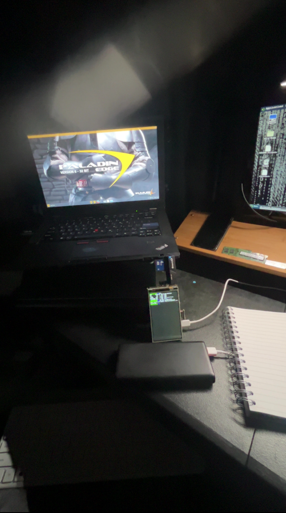
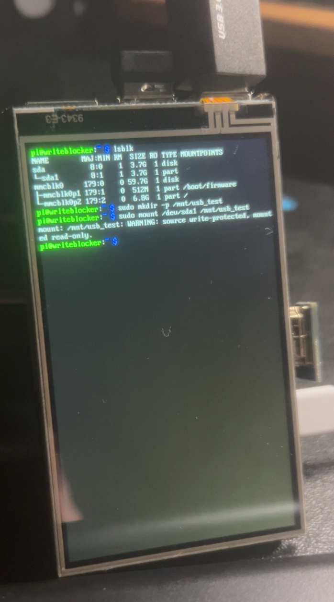
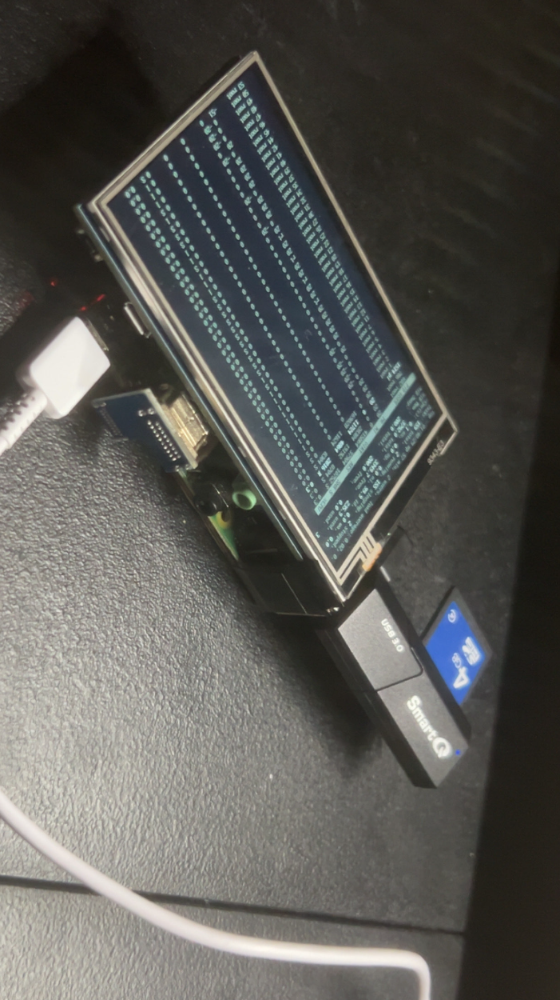
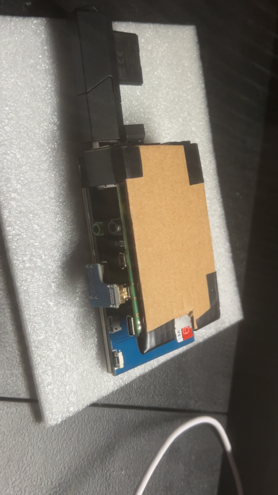

## Raspberry Pi (4B, 4GB) Forensic Write-Blocker

### Author
ezloomdev

### Disclaimer

- This Raspberry Pi forensic write-blocker is intended for educational and home-lab purposes only.
- It is not certified for professional digital forensics and should not be used as the sole method to handle real evidence.
- Always follow proper chain-of-custody and professional forensic procedures when handling critical or legal data.

### Purpose
A forensic write-blocker's job is to protect the integrity of the original evidence drive from any accidental writes while allowing you to:

- Examine the drive
- Create a forensic image
- Verify the image integrity

This Raspberry Pi acts as the middleman:

Evidence drive → read-only → image drive / analysis

This setup is built on Raspberry Pi OS (64-bit) running on a Raspberry Pi 4B with 4GB RAM, optimized for lightweight forensic tasks, stability, and fast USB handling.

### What the Pi Does

### Detect the evidence drive
- Automatically detects when a USB drive is connected using udev
- Example: `lsblk` will show `/dev/sda` or `/dev/sdb`
- Any plugged-in USB is immediately recognized as the evidence drive

### Block writes automatically
- udev-triggered script sets the device read-only at the block level
```bash
sudo blockdev --setro /dev/sda
```
- Notification/log confirms the action
```bash
logger "USB device /dev/sda set to read-only."
```
- Optionally, mount read-only for safe browsing
```bash
sudo mount -o ro /dev/sda1 /mnt/evidence
```
- Write attempts fail
```bash
touch testfile.txt
# Output: touch: cannot touch 'testfile.txt': Read-only file system
```

### Forensic imaging tools

- Two terminal imaging tools are installed
- ddrescue → resilient imaging for error-prone drives
- dcfldd → forensic imaging with hash verification
- Example usage:
```bash
sudo ddrescue -f -n /dev/sda /dev/sdb /home/pi/rescue.log
sudo dcfldd if=/dev/sda of=/dev/sdb hash=sha256 hashlog=/home/pi/hash.log
```

### Verify image integrity

- Compare hashes to confirm the copy matches the original
```bash
sudo sha256sum /dev/sda1
sudo sha256sum /dev/sdb1
```
- `blockdev --getro /dev/sda` returns 1 if read-only

### Browse evidence safely

- Mount read-only to inspect files
```bash
sudo mkdir -p /mnt/evidence
sudo mount -o ro /dev/sda1 /mnt/evidence
ls /mnt/evidence
```
- Never mount the original drive read-write

### Automatic logging and notification

- udev script `/usr/local/bin/usb-readonly.sh`

```bash
#!/bin/bash
DEVNAME="/dev/$1"
sudo blockdev --setro $DEVNAME
logger "USB device $DEVNAME set to read-only."
```
- udev rule `/etc/udev/rules.d/99-usb-readonly.rules`
```bash
ACTION=="add", SUBSYSTEM=="block", ENV{ID_BUS}=="usb", RUN+="/usr/local/bin/usb-readonly.sh %k"
```
- System log shows
```bash
USB device /dev/sdb1 set to read-only
```
### Testing the write-blocker

- Plug in USB (/dev/sdb1)
- Script sets it read-only automatically
- Mount and inspect
```bash
sudo mkdir -p /mnt/testusb
sudo mount -o ro /dev/sdb1 /mnt/testusb
cd /mnt/testusb
ls
```
- Attempt writing fails
```bash
touch testfile.txt
# Output: touch: cannot touch 'testfile.txt': Read-only file system
```
- Device is now ready for imaging and analysis

### Photos






### Reference

- https://sechaq.medium.com/building-my-own-write-blocker-cbf687eb0fd0